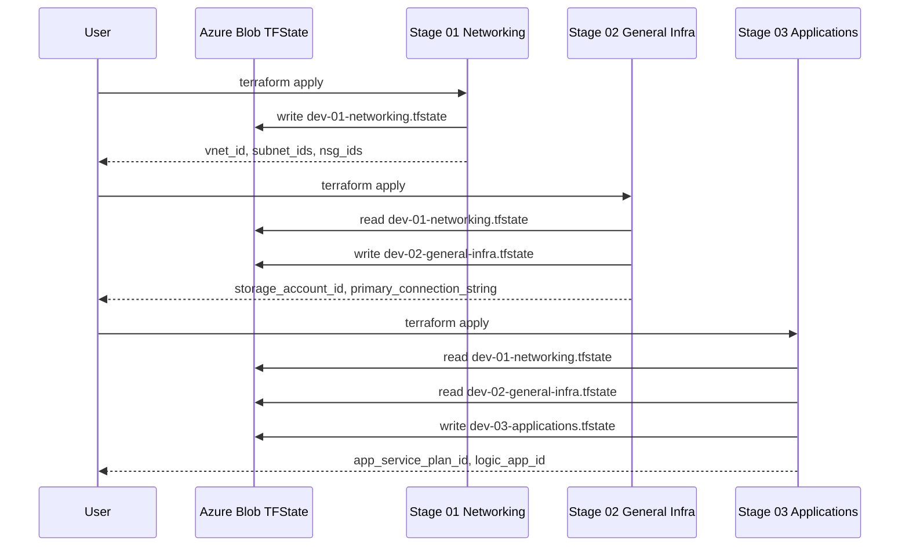

# az-modules-tf

Reusable Terraform modules for Azure infrastructure. Reference these modules directly from your own Terraform configurations using GitHub as the module source.

## Prerequisites

- [Terraform](https://www.terraform.io/downloads.html) >= 1.0
- [Azure CLI](https://docs.microsoft.com/en-us/cli/azure/install-azure-cli) installed and authenticated (`az login`)
- An Azure subscription with appropriate permissions

## Provider Requirements

All modules require the AzureRM provider. The `logic-app-standard` module additionally requires the AzAPI provider.

```hcl
terraform {
  required_providers {
    azurerm = {
      source  = "hashicorp/azurerm"
      version = "~> 4.0"
    }
    # Only required if using the logic-app-standard module
    azapi = {
      source  = "azure/azapi"
      version = "~> 2.0"
    }
  }
}

provider "azurerm" {
  features {}
}
```

## Referencing Modules

Reference modules from GitHub using the double-slash (`//`) syntax to point to a subdirectory:

```hcl
module "virtual_network" {
  source = "github.com/Buddhika-Kuruppu/az-modules-tf//modules/virtual-network?ref=main"
  # ...
}
```

Use `?ref=<tag>` to pin to a specific release tag for production stability.

---

## Available Modules

| Module | Description |
|---|---|
| [virtual-network](#virtual-network) | VNet with integrated NSG management |
| [subnet](#subnet) | Standalone subnet within an existing VNet |
| [network-security-group](#network-security-group) | NSG with custom security rules |
| [vnet-peering](#vnet-peering) | Bidirectional VNet peering |
| [virtual-wan](#virtual-wan) | Virtual WAN for enterprise-scale connectivity |
| [private-dns-zone](#private-dns-zone) | Private DNS zone with VNet links |
| [private-dns-resolver](#private-dns-resolver) | DNS resolver with forwarding rules |
| [storage-account](#storage-account) | Storage account with optional subresources |
| [app-service-plan](#app-service-plan) | App Service Plan (hosting compute) |
| [app-service-environment-v3](#app-service-environment-v3) | Isolated App Service Environment v3 |
| [logic-app-standard](#logic-app-standard) | Standard Logic App for workflow automation |
| [application-gateway](#application-gateway) | Application Gateway / WAF |
| [api-management](#api-management) | API Management service |

---

## Module Reference

### virtual-network

Creates a Virtual Network. NSGs can be defined inline and associated with subnets.

```hcl
module "virtual_network" {
  source = "github.com/Buddhika-Kuruppu/az-modules-tf//modules/virtual-network?ref=main"

  name                = "vnet-prod-001"
  location            = "eastus"
  resource_group_name = "rg-network-prod"
  address_space       = ["10.0.0.0/16"]

  network_security_groups = {
    nsg-app = {
      rules = [
        {
          name                       = "allow-https"
          priority                   = 100
          direction                  = "Inbound"
          access                     = "Allow"
          protocol                   = "Tcp"
          source_port_range          = "*"
          destination_port_range     = "443"
          source_address_prefix      = "*"
          destination_address_prefix = "*"
        }
      ]
    }
  }

  tags = {
    Environment = "prod"
    ManagedBy   = "Terraform"
  }
}
```

**Key outputs:** `id`, `name`, `location`, `address_space`, `network_security_groups`

---

### subnet

Creates a subnet within an existing VNet. Supports service delegations and NSG association.

```hcl
module "subnet" {
  source = "github.com/Buddhika-Kuruppu/az-modules-tf//modules/subnet?ref=main"

  name                 = "snet-app-001"
  resource_group_name  = "rg-network-prod"
  virtual_network_name = module.virtual_network.name
  address_prefixes     = ["10.0.1.0/24"]

  # Optional: associate an NSG
  network_security_group_id = module.nsg.id

  # Optional: service delegation (e.g. for App Service VNet integration)
  delegations = {
    app-service = {
      name    = "Microsoft.Web/serverFarms"
      actions = ["Microsoft.Network/virtualNetworks/subnets/action"]
    }
  }
}
```

**Key outputs:** `id`, `name`, `address_prefixes`

---

### network-security-group

Creates a standalone NSG with configurable security rules.

```hcl
module "nsg" {
  source = "github.com/Buddhika-Kuruppu/az-modules-tf//modules/network-security-group?ref=main"

  name                = "nsg-app-001"
  location            = "eastus"
  resource_group_name = "rg-network-prod"

  security_rules = [
    {
      name                       = "allow-https"
      priority                   = 100
      direction                  = "Inbound"
      access                     = "Allow"
      protocol                   = "Tcp"
      source_port_range          = "*"
      destination_port_range     = "443"
      source_address_prefix      = "*"
      destination_address_prefix = "*"
      description                = "Allow inbound HTTPS"
    },
    {
      name                       = "deny-all-inbound"
      priority                   = 4096
      direction                  = "Inbound"
      access                     = "Deny"
      protocol                   = "*"
      source_port_range          = "*"
      destination_port_range     = "*"
      source_address_prefix      = "*"
      destination_address_prefix = "*"
      description                = "Deny all other inbound"
    }
  ]

  tags = {
    Environment = "prod"
  }
}
```

**Key outputs:** `id`, `name`, `location`

---

### vnet-peering

Creates bidirectional VNet peering between two VNets. The reverse peering is created by default.

```hcl
module "vnet_peering" {
  source = "github.com/Buddhika-Kuruppu/az-modules-tf//modules/vnet-peering?ref=main"

  peering_name_source_to_destination   = "vnet-hub-to-spoke"
  peering_name_destination_to_source   = "vnet-spoke-to-hub"

  source_vnet_name                     = "vnet-hub-001"
  source_vnet_id                       = module.hub_vnet.id
  source_vnet_resource_group_name      = "rg-hub-network"

  destination_vnet_name                = "vnet-spoke-001"
  destination_vnet_id                  = module.spoke_vnet.id
  destination_vnet_resource_group_name = "rg-spoke-network"

  create_reverse_peering               = true
  allow_virtual_network_access         = true
  allow_forwarded_traffic              = true
  allow_gateway_transit                = false
  use_remote_gateways                  = false
}
```

**Key outputs:** `source_to_destination_peering_id`, `destination_to_source_peering_id`

---

### virtual-wan

Creates a Virtual WAN for enterprise-scale, hub-and-spoke network topology.

```hcl
module "virtual_wan" {
  source = "github.com/Buddhika-Kuruppu/az-modules-tf//modules/virtual-wan?ref=main"

  name                = "vwan-prod-001"
  location            = "eastus"
  resource_group_name = "rg-connectivity-prod"
  type                = "Standard"

  allow_branch_to_branch_traffic    = true
  disable_vpn_encryption            = false
  office365_local_breakout_category = "None"

  tags = {
    Environment = "prod"
  }
}
```

**Key outputs:** `id`, `name`, `type`

---

### private-dns-zone

Creates a private DNS zone and links it to one or more VNets.

```hcl
module "private_dns_zone" {
  source = "github.com/Buddhika-Kuruppu/az-modules-tf//modules/private-dns-zone?ref=main"

  name                = "privatelink.blob.core.windows.net"
  resource_group_name = "rg-dns-prod"

  virtual_network_links = {
    link-to-hub = {
      name               = "pdnslink-hub"
      virtual_network_id = module.hub_vnet.id
      registration_enabled = false
    }
    link-to-spoke = {
      name               = "pdnslink-spoke"
      virtual_network_id = module.spoke_vnet.id
      registration_enabled = false
    }
  }

  tags = {
    Environment = "prod"
  }
}
```

**Key outputs:** `id`, `name`, `virtual_network_links`

---

### private-dns-resolver

Creates a Private DNS Resolver with inbound/outbound endpoints and optional forwarding rules.

```hcl
module "private_dns_resolver" {
  source = "github.com/Buddhika-Kuruppu/az-modules-tf//modules/private-dns-resolver?ref=main"

  name                = "dnsresolver-prod-001"
  resource_group_name = "rg-dns-prod"
  location            = "eastus"
  virtual_network_id  = module.hub_vnet.id

  inbound_endpoints = {
    inbound = {
      name      = "inbound-endpoint"
      subnet_id = module.inbound_subnet.id
    }
  }

  outbound_endpoints = {
    outbound = {
      name      = "outbound-endpoint"
      subnet_id = module.outbound_subnet.id
    }
  }

  dns_forwarding_rulesets = {
    ruleset1 = {
      name                  = "forwarding-ruleset"
      outbound_endpoint_keys = ["outbound"]
    }
  }

  forwarding_rules = {
    onprem = {
      name        = "onprem-forward"
      ruleset_key = "ruleset1"
      domain_name = "corp.internal."
      enabled     = true
      target_dns_servers = [
        { ip_address = "192.168.1.10", port = 53 },
        { ip_address = "192.168.1.11", port = 53 }
      ]
    }
  }

  virtual_network_links = {
    spoke-link = {
      name               = "spoke-vnet-link"
      ruleset_key        = "ruleset1"
      virtual_network_id = module.spoke_vnet.id
    }
  }

  tags = {
    Environment = "prod"
  }
}
```

**Key outputs:** `id`, `name`, `inbound_endpoints`, `outbound_endpoints`, `dns_forwarding_rulesets`

---

### storage-account

Creates a Storage Account. Includes optional submodules for containers, file shares, queues, and tables.

```hcl
module "storage_account" {
  source = "github.com/Buddhika-Kuruppu/az-modules-tf//modules/storage-account?ref=main"

  name                = "stprod001"   # must be globally unique, 3-24 lowercase alphanumeric
  resource_group_name = "rg-infra-prod"
  location            = "eastus"

  account_tier             = "Standard"
  account_replication_type = "ZRS"
  account_kind             = "StorageV2"
  access_tier              = "Hot"

  enable_https_traffic_only          = true
  min_tls_version                    = "TLS1_2"
  allow_nested_items_to_be_public    = false
  shared_access_key_enabled          = true

  # Optional: restrict network access
  network_rules = {
    default_action             = "Deny"
    bypass                     = ["AzureServices"]
    ip_rules                   = ["203.0.113.0/24"]
    virtual_network_subnet_ids = [module.subnet.id]
  }

  tags = {
    Environment = "prod"
  }
}
```

**Key outputs:** `id`, `name`, `primary_blob_endpoint`, `primary_access_key` *(sensitive)*, `primary_connection_string` *(sensitive)*

#### Storage Submodules

Use these alongside the storage account module to create child resources:

**Blob Container**
```hcl
module "blob_container" {
  source = "github.com/Buddhika-Kuruppu/az-modules-tf//modules/storage-account/storage-blob-container?ref=main"

  name                  = "mycontainer"
  storage_account_name  = module.storage_account.name
  container_access_type = "private"
}
```

**File Share**
```hcl
module "file_share" {
  source = "github.com/Buddhika-Kuruppu/az-modules-tf//modules/storage-account/storage-file-share?ref=main"

  name                 = "myshare"
  storage_account_name = module.storage_account.name
  quota                = 100   # GB
  enabled_protocol     = "SMB"
  access_tier          = "TransactionOptimized"
}
```

**Queue**
```hcl
module "storage_queue" {
  source = "github.com/Buddhika-Kuruppu/az-modules-tf//modules/storage-account/storage-queue?ref=main"

  name                 = "myqueue"
  storage_account_name = module.storage_account.name
}
```

**Table**
```hcl
module "storage_table" {
  source = "github.com/Buddhika-Kuruppu/az-modules-tf//modules/storage-account/storage-table?ref=main"

  name                 = "mytable"
  storage_account_name = module.storage_account.name
}
```

---

### app-service-plan

Creates an App Service Plan to host web apps and logic apps.

```hcl
module "app_service_plan" {
  source = "github.com/Buddhika-Kuruppu/az-modules-tf//modules/app-service-plan?ref=main"

  name                = "asp-prod-001"
  resource_group_name = "rg-apps-prod"
  location            = "eastus"
  os_type             = "Linux"   # "Linux" or "Windows"
  sku_name            = "P1v3"

  worker_count             = 2
  zone_balancing_enabled   = true
  per_site_scaling_enabled = false

  tags = {
    Environment = "prod"
  }
}
```

**Key outputs:** `id`, `name`, `kind`, `reserved`

**Common SKUs:** `B1`, `B2`, `B3` (Basic) | `S1`, `S2`, `S3` (Standard) | `P1v2`–`P3v2`, `P1v3`–`P3v3` (Premium) | `Y1` (Consumption) | `EP1`–`EP3` (Elastic Premium)

---

### app-service-environment-v3

Creates an App Service Environment v3 for isolated, single-tenant hosting.

> **Note:** ASE v3 provisioning takes approximately 2–3 hours and requires a dedicated `/24` or larger subnet.

```hcl
module "ase" {
  source = "github.com/Buddhika-Kuruppu/az-modules-tf//modules/app-service-environment-v3?ref=main"

  name                = "ase-prod-001"
  resource_group_name = "rg-apps-prod"
  subnet_id           = module.ase_subnet.id

  internal_load_balancing_mode = "Web, Publishing"
  zone_redundant               = true
  dedicated_host_count         = 2

  allow_new_private_endpoint_connections = true
  remote_debugging_enabled               = false

  tags = {
    Environment = "prod"
  }
}
```

**Key outputs:** `id`, `name`, `dns_suffix`, `internal_inbound_ip_addresses`, `linux_outbound_ip_addresses`

---

### logic-app-standard

Creates a Standard Logic App. Requires an App Service Plan and a Storage Account.

> **Note:** This module requires both `azurerm ~> 4.0` and `azapi ~> 2.0` providers.

```hcl
module "logic_app" {
  source = "github.com/Buddhika-Kuruppu/az-modules-tf//modules/logic-app-standard?ref=main"

  name                = "logic-prod-001"
  resource_group_name = "rg-apps-prod"
  location            = "eastus"

  app_service_plan_id        = module.app_service_plan.id
  storage_account_name       = module.storage_account.name
  storage_account_access_key = module.storage_account.primary_access_key

  https_only            = true
  public_network_access = "Disabled"
  version               = "~4"

  # VNet integration (recommended for private deployments)
  virtual_network_subnet_id  = module.integration_subnet.id
  vnet_content_share_enabled = true

  app_settings = {
    FUNCTIONS_WORKER_RUNTIME = "node"
    WEBSITE_RUN_FROM_PACKAGE = "1"
  }

  identity = {
    type = "SystemAssigned"
  }

  site_config = {
    always_on = true
  }

  tags = {
    Environment = "prod"
  }
}
```

**Key outputs:** `id`, `name`, `default_hostname`, `outbound_ip_addresses`, `identity`

---

### application-gateway

Creates an Application Gateway (Standard v2 or WAF v2) with autoscaling.

```hcl
module "app_gateway" {
  source = "github.com/Buddhika-Kuruppu/az-modules-tf//modules/application-gateway?ref=main"

  name                = "agw-prod-001"
  resource_group_name = "rg-network-prod"
  location            = "eastus"

  sku_name = "WAF_v2"
  sku_tier = "WAF_v2"

  subnet_id            = module.agw_subnet.id
  public_ip_address_id = azurerm_public_ip.agw.id

  frontend_port     = 443
  backend_port      = 80
  backend_protocol  = "Http"
  backend_fqdns     = ["app.internal.example.com"]

  min_capacity = 1
  max_capacity = 10

  tags = {
    Environment = "prod"
  }
}
```

**Key outputs:** `id`, `name`

---

### api-management

Creates an API Management service instance.

> **Note:** Developer and Basic tiers can take 30–45 minutes to provision.

```hcl
module "apim" {
  source = "github.com/Buddhika-Kuruppu/az-modules-tf//modules/api-management?ref=main"

  name                = "apim-prod-001"
  resource_group_name = "rg-apps-prod"
  location            = "eastus"

  publisher_name  = "Contoso Ltd"
  publisher_email = "api-admin@contoso.com"
  sku_name        = "Developer_1"   # Developer_1, Basic_1, Standard_1, Premium_1

  # Optional: VNet integration (Premium SKU required for internal mode)
  virtual_network_configuration = {
    subnet_id = module.apim_subnet.id
  }

  identity = {
    type = "SystemAssigned"
  }

  tags = {
    Environment = "prod"
  }
}
```

**Key outputs:** `id`, `name`, `gateway_url`, `developer_portal_url`, `private_ip_addresses`, `identity`

---

## Three-Stage Environment Pattern

The `environments/` directory demonstrates a recommended layered deployment pattern. Each stage manages a distinct concern and passes outputs to the next stage via Terraform remote state.

```
environments/dev/
├── 01-networking/      # VNets, Subnets, NSGs
├── 02-general-infra/   # Storage accounts, shared resources
└── 03-applications/    # App Service Plans, Logic Apps, APIM
```

### Deployment sequence

```bash
# Stage 1 — Networking foundation
cd environments/dev/01-networking
terraform init
terraform apply

# Stage 2 — Shared infrastructure (reads Stage 1 state)
cd ../02-general-infra
terraform init
terraform apply

# Stage 3 — Applications (reads Stage 1 and 2 state)
cd ../03-applications
terraform init
terraform apply
```



### Cross-stage state reference example

```hcl
# In Stage 02 — read networking outputs from Stage 01
data "terraform_remote_state" "networking" {
  backend = "azurerm"
  config = {
    resource_group_name  = "rg-tfstate"
    storage_account_name = "sttfstate001"
    container_name       = "tfstate"
    key                  = "dev-01-networking.tfstate"
  }
}

# Use the subnet ID from Stage 01
resource "..." "example" {
  subnet_id = data.terraform_remote_state.networking.outputs.subnet_ids["subnet1"]
}
```

---

## Directory Structure

```
az-modules-tf/
├── modules/
│   ├── api-management/
│   ├── app-service-environment-v3/
│   ├── app-service-plan/
│   ├── application-gateway/
│   ├── logic-app-standard/
│   ├── network-security-group/
│   ├── private-dns-resolver/
│   ├── private-dns-zone/
│   ├── storage-account/
│   │   ├── storage-blob-container/
│   │   ├── storage-file-share/
│   │   ├── storage-queue/
│   │   └── storage-table/
│   ├── subnet/
│   ├── virtual-network/
│   ├── virtual-wan/
│   └── vnet-peering/
└── environments/
    └── dev/
        ├── 01-networking/
        ├── 02-general-infra/
        └── 03-applications/
```

---

## Contributing

1. Fork the repository
2. Create a feature branch: `git checkout -b feature/my-module`
3. Commit your changes: `git commit -m 'Add my-module'`
4. Push to the branch: `git push origin feature/my-module`
5. Open a Pull Request

## License

This project is licensed under the MIT License — see the [LICENSE](LICENSE) file for details.
